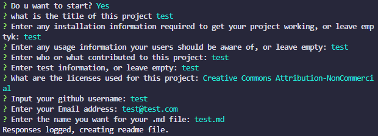

# Read me generator 
### Read me generator's ReadMe
## Table of Contents
- [Installation](#installation)
- [Contributions](#contributions)
- [Testing](#testing)
- [License](#license)
- [Questions](#questions)

##final result

A video walkthrough is available [here](https://drive.google.com/file/d/1KD0fTXxCnHwmN51cZ9DuGGNdI1U9VeqM/view?usp=sharing).
## Installation:
using npm install inquire
## Contributions
Me and the licensed apis
## Testing
no testing
## License
This project utilizes the <a href="https://opensource.org/licenses/MPL-2.0">Mozilla Public License 2.0</a> license.
## Questions
For questions, you may contact craftersol728 via email: <a href="mailto:jp4eva15@gmail.com">jp4eva15@gmail.com</a>